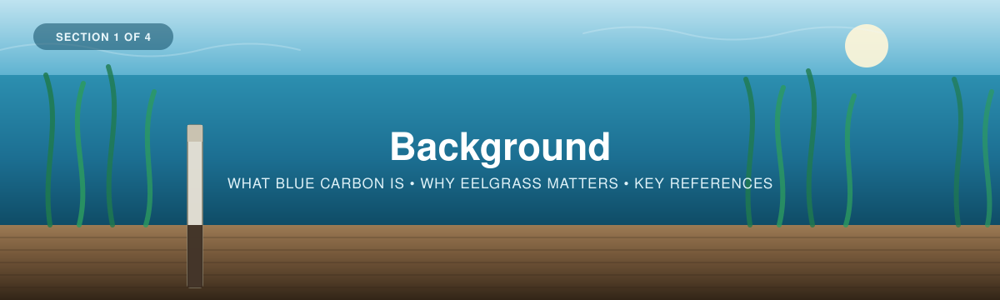
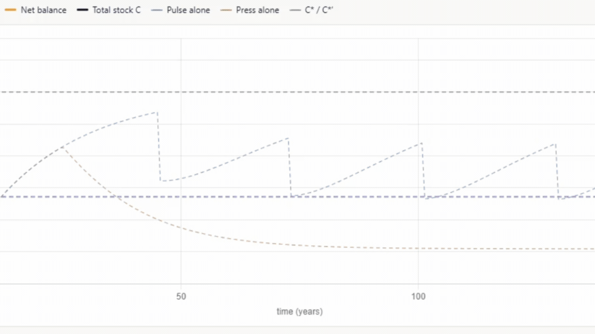

  

---

[← Back to main guide](../README.md) · Next: [2 — Project Planning →](../02_Project_Planning/)

---

# Part 1 — Background

*Intro to blue carbon in eelgrass ecosystems, and why sediment carbon matters.*

**Quick links:** [Workshop Presentation Slides](BlueCarbon_EelgrassPPT_FinalV1.pptx) · [WWF-Canada Coastal Blue Carbon Guide](https://wwf.ca/wp-content/uploads/2026/04/Coastal-Blue-Carbon-Field-Guide-FINAL.pdf) · [Howard et al. (2014) Blue Carbon Manual](https://www.thebluecarboninitiative.org/manual)

---

## What is blue carbon?

**Blue carbon** is the organic carbon captured and stored by coastal and marine
ecosystems. In Canada, this is primarily **seagrass/eelgrass meadows and tidal salt
marshes**. These habitats are among the most efficient carbon sinks on Earth: For example, per unit
area, eelgrass ecosystems can bury organic carbon faster than terrestrial forests, and because it
is locked away in waterlogged, low-oxygen sediment, that carbon can remain stored for
centuries to millennia.

Two common concepts used to describe blue carbon ecosystems are **sequestration** and **storage**

1. **Sequestration** — Describes the process of living plants pulling CO₂ out of the water and atmosphere.
2. **Storage** — When sequestered carbon remains in the ecosystem, we say it is a "carbon store". The bulk of the carbon accumulates in the *sediment* beneath the
   meadow, not in the plants themselves. This is why our sampling focuses on
   sediment cores rather than biomass alone.

<table>
<tr>
<td width="60%">

</td>
<td width="40%">

The plants, the soil, the water, and the air in this diagram represent the carbon
**pools** ("stocks"), the places that hold carbon at any point in time and can be
directly measured. The arrows represent the **processes** ("fluxes") that move carbon
between the pools. Fluxes over time control the pools, and ultimately the net
sequestration.

</td>
</tr>
</table>

> 🎥 **Watch:** [*Carbon stocks in sediment cores*](https://www.youtube.com/watch?v=2qAVE35UbiI&list=PLLsjpJMfNDP5w78ZJNDUvMj1VoRG_qSwd&index=1) — workshop playlist

---

## Eelgrass (*Zostera marina*)

Eelgrass is the dominant temperate seagrass across the North Atlantic. As a foundation
species it stabilises sediment, slows water flow (which encourages more particles to
settle and be buried), and supports fisheries and biodiversity, while continuously
adding organic carbon to the seabed.

<table>
<tr>
<td width="60%">

</td>
<td width="40%">

Eelgrass ecosystems can accumulate carbon derived from two places:

  1. "Autochthonous" carbon describes the accumulation of plant material growing within the ecosystem, deposited over time.
     
  2. "Allochthonous" carbon describes the accumulation of sediment and plant material transported into the ecosystem from surrounding environments.

</td>
</tr>
</table>

<table>
<tr>
<td width="60%">

</td>
<td width="40%">

Eelgrass sediments typically hold lower organic carbon concentrations compared to
other coastal ecosystems, but thanks to their deep sediment pools, they typically
store more carbon overall than terrestrial forests.

</td>
</tr>
</table>

---

## Carbon accumulation and equilibrium

<table>
<tr>
<td width="60%">

</td>
<td width="40%">

The balance of these carbon accumulating processes is countered by the decomposition of organic material
via soil microbial processes, and the transport of material out of the ecosystem by
tidal processes. The more sediment that accumulates, the more loss occurs over time, until
the ecosystem reaches a balance, referred to as the ecosystem's "carbon equilibrium
state", or simply "net ecosystem carbon balance"

</td>
</tr>
</table>

<table>
<tr>
<td width="60%">

</td>
<td width="40%">

Healthy ecosystems accumulate carbon over time and respond resiliently to
environmental and human-caused disturbances.

</td>
</tr>
</table>

We can visualize this with a graph: The balance of carbon entering the ecosystem
(green), the loss of carbon (red), and the net balance of these two processes (black).

<table>
<tr>
<td width="60%">

</td>
<td width="40%">

Here is an ecosystem carbon curve, showing the baseline accumulation of carbon over
time. As sequestration (carbon in) and loss (carbon out) converge, the amount of carbon
stored in the ecosystem levels off at a "peak," or equilibrium (represented by the dashed line)

</td>
</tr>
</table>

<table>
<tr>
<td width="60%">

</td>
<td width="40%">

And here is the same ecosystem, but with a disturbance that causes a loss and
recovery of carbon.

</td>
</tr>
</table>

However, if/when multiple overlapping disturbances occur, the ecosystem can continue to
degrade over time, becoming a net emitter of carbon and losing the carbon it had stored. This is common in ecosystems experiencing "multiple stressors", "cumulative effects", and/or "altered disturbance regimes"

<table>
<tr>
<td width="60%">

</td>
<td width="40%">

Here we see **"pulse"** disturbances, such as severe storms or land clearing, which disturb the
ecosystem abruptly, paired with **"press"** disturbances, which act slowly over long periods,
such as warming temperatures or spreading invasive species. Acting together, they can collapse the
ecosystem.

</td>
</tr>
</table>

## Interactive: Ecosystem Carbon Accumulation Visualizer

Explore how carbon accumulates in coastal ecosystems over time with the interactive
tool built for this workshop:

**👉 [cathald.github.io/CarbonAccumulationVisualizer](https://cathald.github.io/CarbonAccumulationVisualizer/)**

---
## What is sediment anyway?

Over time, as particles are transported into an ecosystem, or as plants growing within
it contribute organic matter (recall the allochthonous vs. autochthonous distinction),
these materials settle and build up, forming sediment.

<table>
<tr>
<td width="60%">

</td>
<td width="40%">

Taking a section of the sediment reveals the layers of accumulation over time.

</td>
</tr>
</table>

---
## So how do you measure sediment carbon?

Measuring carbon requires collecting a **sediment core**, determining how much
sediment is there (from its **volume** and dry **weight**), and measuring how much of that
sediment is carbon (its **organic carbon concentration**).

However, as simple as this sounds, aligning the actual measurements with the project's
larger goals ensures the samples you collect are used as effectively as possible. To
do this, there are 4 basic steps:

1. Apply a **sampling design**
2. Obtain **sediment core samples**
3. **Analyse** the samples
4. **Calculate carbon** and **interpret** the results

The first two steps are the workshop's two core jobs (see the [main guide](../README.md)):

- **Making the data useful** (step 1) — *before* collecting anything, design the sampling so
  the data you'll gather aligns with the answers to your team's questions. That's
  [Section 2 — Project Planning](../02_Project_Planning/).
- **Collecting the data** (step 2) — Taking sediment cores and recording information required to obtain the data,
  That's [Section 3 — Field Methods](../03_Field_Methods/).

Steps 3 and 4 — analysing the samples and calculating carbon — are
[Section 4 — Data Interpretation](../04_Data_Interpretation/). Done together, they ensure the
samples you collect are used as effectively as possible to support your project and
organizational goals.

<table>
<tr>
<td width="100%">

</td>
</tr>
</table>

---

## In the next section

We'll start with **Project Planning**, here we will work on building a sampling plan, determining how
many samples to take and where to take them, in a way that best aligns with team,
organization, and community goals.

