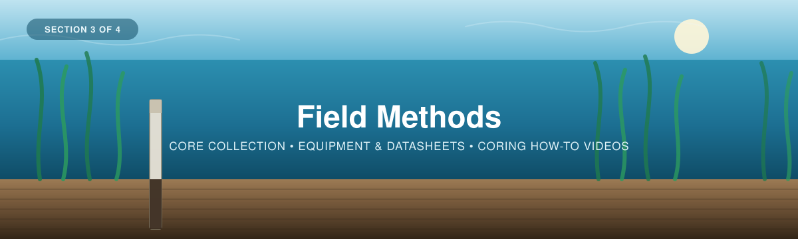
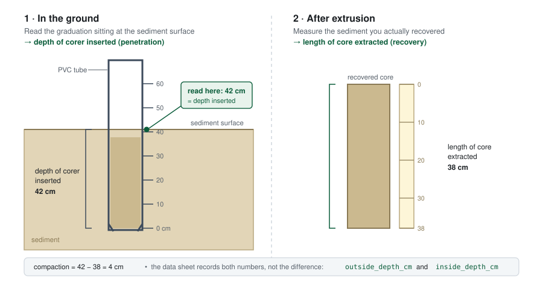

<p align="center">
  
</p>

---

# Part 3 — Field Methods

*Collecting sediment cores in the field.*

[← 2 — Project Planning](../02_Project_Planning/) · [Back to main guide](../README.md) · Next: [4 — Data Interpretation →](../04_Data_Interpretation/)

---

## Overview

This section of the workshop focuses on **collecting the data** in the field. Once the sampling design is set
([Section 2](../02_Project_Planning/)), it's time for the field team to collect **sediment
cores**. Here we cover the necessary equipment, tips for consistent
coring, compaction measurement, and completing the
[**field data sheet**](../Eelgrass_Carbon_Datasheet_v2.pdf) (blank, printable copies are in
[`datasheets/`](datasheets/); see [Field data sheet](#field-data-sheet), below).

The method shown is push (also known as percussion) coring with a PVC pipe, a cost-effective method that is commonly used in coastal ecosystems. Note that equipment requirements are
similar for both salt marsh and seagrass ecosystems, and the methods may need to be adapted for
the conditions you are working in.

**Important note when coring underwater.** The videos show coring in tidal marsh ecosystems, *above* the water table, whereas seagrass/eelgrass ecosystems tend to be fully covered by the tides, especially in areas further from the coast, where coring takes place **underwater**. The good news: the method is essentially the same, with **one additional piece of equipment** to take those underwater samples (see [Equipment](#equipment), below).

### Sources for this section

This section follows WWF-Canada's field guide
*[Measuring Carbon in Coastal Sediments](../Coastal-Blue-Carbon-Field-Guide-FINAL.pdf)* (2026) —
together with the accompanying video playlists:

> 🎥 [*"Introduction to Sediment Cores"* — workshop playlist](https://www.youtube.com/playlist?list=PLLsjpJMfNDP5w78ZJNDUvMj1VoRG_qSwd)
>
> 🎥 **Eelgrass-specific videos:** [IORA Blue Carbon Hub playlist](https://www.youtube.com/playlist?list=PL9pJDSsl2ZslDVZ5oZ5MFkykY2Kn9rDS8)

Individual videos are linked at the step they belong to, throughout this page.

---

## Equipment

Before heading out, gather and lay out the coring equipment. There are many types of corers
available, each with distinct advantages and limitations; here we use a push coring method
with a PVC pipe. The PVC tubing used to to core should be as long as
the target depth for the core (usually between 30 cm and 1 m), with approximately 20 cm of
additional headspace. Three- or four-inch diameter tubing is usually used, and you will need
top and bottom endcaps to fit each tube.

For a full list of recommended equipment see here:

<table>
<tr>
<td width="45%">


</td>
<td width="55%">

**1 · For setting up the plot**

- GPS unit
- Clipboard
- 50 m tape measure
- Notebook and pencil/pen (or printed datasheet)
- Quadrat *(optional — for measuring vegetation biomass)*

</td>
</tr>
<tr>
<td width="45%">


</td>
<td width="55%">

**2 · For taking a sediment core**

- PVC coring tube(s), 3–4″ diameter, cut to target depth + ~20 cm headspace, bevelled at one end
- Top and bottom endcaps to fit each tube
- Sledgehammer and a piece of lumber/plywood (impact platform for hammering)
- Tape measure / ruler (for compaction and depth measurements)
- Work gloves
- Shovel (to dig around the tube for extraction)
- Soil probe or auger (to find a representative location and the depth of refusal)
- Waders / boat, as appropriate for the site
- **Underwater (eelgrass) only:** a **stop-cap** mechanism (see below)

</td>
</tr>
<tr>
<td width="45%">


</td>
<td width="55%">

**3 · For core extrusion, packaging and processing**

- Custom extruding device (a piston that fits exactly inside the tube, a metal rod, and a platform for stability)
- Paint scraper, small piece of plexiglass, or a serrated knife (for slicing subsections)
- Step stool
- Small sledgehammer
- PVC collar(s) of the desired subsection thickness (usually 1, 2, or 5 cm)
- Cooler with ice packs (samples go to a −20 °C freezer for storage)
- Resealable bags or polypropylene jars (check with your lab for preference)
- Permanent marker / labels

</td>
</tr>
</table>

**Coring underwater**, the tool we recommend is an
additional **stop-cap** mechanism that creates a vacuum seal underwater. This prevents water
from flowing in through the top of the corer, and applies a gravimetric force on the core
upon extrusion. For more information, see the [Universal Corer — Aquatic Research Shop](https://aquaticresearchshop.com/product/universal-corer/).

<table>
<tr>
<td width="50%">


**The kit** — the stop-cap corer assembled and ready to go.

</td>
<td width="50%">


**In use** — taking an underwater core in the field.

</td>
</tr>
</table>

---

## Collecting a core, step by step

Five steps take you from a site location to a cooler full of samples.

| # | Step | Answers |
|---|------|---------|
| 1 | **Select the location** and record conditions | *Where in the plot, and how deep do I core?* |
| 2 | **Insert the corer** | *How to drive the tube in cleanly?* |
| 3 | **Measure compaction** | *How much did the sediment squash?* |
| 4 | **Extract the core** | *How do I get the samples out without losing sediment?* |
| 5 | **Extrude and section** | *How do I slice, bag, and label each sub-subsection?* |

---

### 1. Select the location and record conditions

*Where in the plot, and how deep do I core?*

<table>
<tr>
<td width="42%">


</td>
<td width="58%">

**Find a representative spot**

Across your plot, use a metal rod or soil probe to test how deep the sediment is. This gives
you a rough idea of how far you will need to insert the corer, and where to take the core in a
**representative area** — a spot consistent with the average sediment depth across the plot.

</td>
</tr>
<tr>
<td width="42%">


</td>
<td width="58%">

**Find the depth of refusal**

A soil probe inserted into the sediment (as shown alongside) helps gauge the transition from
sediment to parent material. Sometimes this is obvious — gravel or bedrock — and sometimes the
transition is into clay or mineral deposits, where the density of the sediment increases
sharply.

</td>
</tr>
</table>

<table>
<tr>
<td width="55%">

**📋 Record it on the data sheet — plot notes**

Let the data sheet guide what you need to capture. Fill in the top section now: date and
time, site conditions, weather, and tidal conditions — plus the core's latitude/longitude.

</td>
<td width="45%">


</td>
</tr>
</table>


> 🎥 **Watch:** [*"Core Depths"*](https://www.youtube.com/watch?v=A2es2qv3bPE&list=PLLsjpJMfNDP5w78ZJNDUvMj1VoRG_qSwd&index=3) — video **#3** in the workshop playlist.

---

### 2. Insert the corer

*How do I drive the tube in cleanly?*

<table>
<tr>
<td width="45%">


</td>
<td width="55%">

A **team of three** is needed: two hold the lumber across the tube top, one hammers. The two
people holding the lumber should wear gloves for safety and comfort. Place the bevelled end
down, keep the tube straight, and hammer to the target depth (or depth of refusal). Mark
ruler graduations on the outside of the tube so you can read insertion depth.

</td>
</tr>
</table>

> 🎥 **Watch:** [*"Sediment Coring"*](https://www.youtube.com/watch?v=TVF1JX2Gdw4&list=PLLsjpJMfNDP5w78ZJNDUvMj1VoRG_qSwd&index=4)

<table>
<tr>
<td width="55%">

**📋 Record it on the data sheet — core notes**

You can begin filling in Part 2 of the sheet: the **Core ID**, and the core's
latitude/longitude.

</td>
<td width="45%">


</td>
</tr>
</table>

---

### 3. Measure compaction

*How much did the sediment squash?*

> 💡 **Reduce compaction before you measure it.** The less the sediment is squished, the
> less correction the analysis has to apply. Use the **bevelled edge** of the corer to *cut*
> through the top layer of sediment that contains the fibrous roots, rather than
> forcing through it. A gentle **twisting motion** while inserting helps the bevel slice
> cleanly.

<table>
<tr>
<td width="45%">


</td>
<td width="55%">

As the PVC pipe is hammered into the ground, the sediment can become compacted. This can be accounted for when analyzing the data, but must be measured.

With the tube fully inserted, measure the distance from the top of the PVC tube to the
sediment surface on both the **outside** and the **inside** of the tube. The difference
between these two measurements is the amount of compaction. Then place an endcap on the top of
the tube.

</td>
</tr>
</table>

#### Two ways to get there

Whichever method you use, you are after the **same two numbers** 

- **Depth of corer inserted** — how far the tube went into the sediment (penetration)
- **Length of core extracted** — how much sediment you actually recovered

Either way, the **difference between the inside and outside measurements is the
compaction**

<table>
<tr>
<td width="50%">

**Method A — mark the tube**

Mark ruler graduations on the outside of the tube before you start. When the tube is
driven in, read the graduation at the sediment surface: that is the **depth of corer
inserted**. After extrusion, measure the recovered core directly: that is the **length
of core extracted**.

</td>
<td width="50%">

**Method B — measure both distances while inserted**

With the tube fully inserted, measure from the **top of the tube** down to the sediment
surface on the **outside** and on the **inside**. Subtract each from the tube's total
length:

```
depth of corer inserted = tube length − outside distance
length of core extracted = tube length − inside distance
```

</td>
</tr>
</table>

<table>
<tr>
<td width="50%">



</td>
<td width="50%">


</td>
</tr>
</table>

> 🎥 **Watch:** [*"Sediment Compaction"*](https://www.youtube.com/watch?v=cW2UIA2Qlp8&list=PLLsjpJMfNDP5w78ZJNDUvMj1VoRG_qSwd&index=5)

<table>
<tr>
<td width="55%">

**📋 Record it on the data sheet — core notes**

Enter the **depth of corer inserted** and the **length of core extracted** in their
respective fields. These two numbers are what the analysis uses to decompact the core.

</td>
<td width="45%">


</td>
</tr>
</table>

---

### 4. Extract the core

*How do I get it out without losing sediment?*

<table>
<tr>
<td width="45%">


</td>
<td width="55%">

Once the corer has reached refusal the core is mostly secure in the tube, and it's time to
remove it. In loose sediments this can be straightforward; in others it is considerably harder.

Where it is harder, **dig alongside the tube** with a shovel (or rock it gently back and
forth) to release the suction between the tube and the surrounding sediment. Once the bottom
end of the tube is visible, cap the **bottom** so no sediment is lost, and keep the core
**upright** so the layers don't mix before it is sectioned.

This is especially challenging in standing water and waterlogged seagrass/eelgrass sediments.
If you lose sediment from the bottom you may end up with a shorter core — in which case pick a
different spot and try again.

</td>
</tr>
</table>

> 🎥 **Watch:** [*"Sediment Core Extraction"*](https://www.youtube.com/watch?v=XUG70s8o5wk&list=PLLsjpJMfNDP5w78ZJNDUvMj1VoRG_qSwd&index=6)
>
> 🎥 **Stubborn cores:** farm jacks and other winch devices can do the lifting for you —
> see [this demonstration](https://www.youtube.com/watch?v=mXHhzlfCKEQ) from Dr. Erin Peck and colleagues.

---

### 5. Extrude and section

*How do I slice, bag, and label it?*

<table>
<tr>
<td width="45%">


**With a stop cap** — gravimetric force holds the sample in the tube, keeping it intact while
you position it onto the extruder.


**Without one** — remove the end cap smoothly as you position the tube. *Slow is smooth,
smooth is fast.*

</td>
<td width="55%">

Transfer the core onto the extruding device, then push it up from the base and slice off each
subsection at the top of the tube with a PVC collar (typically 2-5 cm). Slide each slice into
its prelabelled bag, recording the **Core ID**, **sample number**, and **top/bottom depths**.
The Core ID is a unique identifier for the date, core location, and section depth — for
example, *UC-02-B: 0–2 cm* denotes a core taken in "Ucluelet", "Plot 2", "Sampling location
B", with a depth interval of "0–2 cm". Record the total core length once all subsections are
obtained, and keep the bags cold.

</td>
</tr>
</table>

This step has four short companion videos:

| # | Video | What it covers |
|---|---|---|
| 1 | [*Core extrusion — required materials / background*](https://www.youtube.com/watch?v=kPV0mSSFFDw&list=PLLsjpJMfNDP5w78ZJNDUvMj1VoRG_qSwd&index=7) | Why cores are extruded and sectioned, and what the setup looks like |
| 2 | [*Preparing for extrusion*](https://www.youtube.com/watch?v=YS0vlFjSvtM&list=PLLsjpJMfNDP5w78ZJNDUvMj1VoRG_qSwd&index=8) | Setting up the extruding device and materials before you start |
| 3 | [*Transferring cores to the extruding device*](https://www.youtube.com/watch?v=UJnjyNUiHSA&list=PLLsjpJMfNDP5w78ZJNDUvMj1VoRG_qSwd&index=9) | Moving the core onto the piston/stand without disturbing the layers |
| 4 | [*Slicing subsections as they are extruded*](https://www.youtube.com/watch?v=F2qZQSjPxMs&list=PLLsjpJMfNDP5w78ZJNDUvMj1VoRG_qSwd&index=10) | Cutting even slices and bagging them with their depths |

<!-- Video indices 7–10 match the guide's video ordering (p.4). The earlier note about videos "2 and 3 both at index=9" is resolved: they are index 8 and 9. -->

#### Extruding and sectioning in the field

<table>
<tr>
<td width="50%">


**Salt marsh**

</td>
<td width="50%">


**Eelgrass**

</td>
</tr>
<tr>
<td width="50%">


**Slicing a subsection** at the top of the tube.

</td>
<td width="50%">


**Bagging and labelling** each slice with its depths.

</td>
</tr>
</table>

**DIY extrusion device blueprint.** Build instructions are in this folder:
**[`Making a soil core extractor doc.pdf`](Making%20a%20soil%20core%20extractor%20doc.pdf)**.

<p align="center">
  
</p>

<p align="center">
  
</p>

*Instructions for a do-it-yourself extrusion device using common plumbing elements found at
your local hardware store. Ensure the proportions match those of the PVC pipe you are
using.*

<p align="center">
  
</p>

<p align="center"><em>The finished device in use.</em></p>

<table>
<tr>
<td width="55%">

**📋 Record it on the data sheet — sample data**

As you extrude each section, record its **top and bottom depth** — how far the top and bottom
of that slice sit below the sediment surface.

Depths run continuously down the core, so **the bottom of one slice is the top of the next**:
if section 2 ends at 5 cm, section 3 starts at 5 cm, and so on.

</td>
<td width="45%">


</td>
</tr>
</table>

---

## Field data sheet

The workshop data sheet is included: **[`Eelgrass_Carbon_Datasheet_v2.pdf`](../Eelgrass_Carbon_Datasheet_v2.pdf)**
(blank copies for printing can also live in [`datasheets/`](datasheets/)). It captures
exactly the fields the analysis expects:

- **Plot notes** — Plot ID, date, study area, time, study site, weather/conditions, project name
- **Core notes** (once per core) — Core ID, latitude, longitude, depth of corer inserted, length of core extracted
- **Sample data** (per slice) — Core ID, sample #, top (cm), bottom (cm), notes

<table>
<tr>
<td width="50%">


**Blank data sheet** — ready to print and take into the field.

</td>
<td width="50%">


**Filled-in example** — the same sheet completed for the eelgrass inlet site from
[Section 2 — Project Planning](../02_Project_Planning/).

</td>
</tr>
</table>

---

## In this section

- [`Eelgrass_Carbon_Datasheet_v2.pdf`](../Eelgrass_Carbon_Datasheet_v2.pdf) — the workshop field data sheet.
- [`datasheets/`](datasheets/) — blank/printable data sheets.
- [`Making a soil core extractor doc.pdf`](Making%20a%20soil%20core%20extractor%20doc.pdf) — DIY extrusion device build instructions.
- [`method_a_graduations.svg`](method_a_graduations.svg) — Method A compaction diagram (reading graduations on the tube).
- `images/` — field method photos and diagrams.
